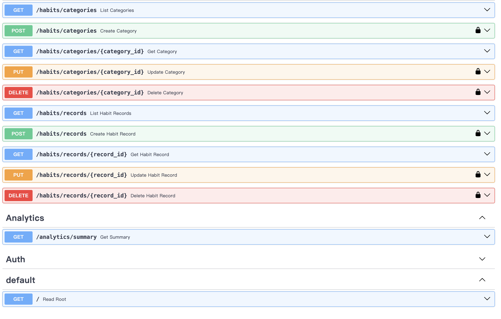
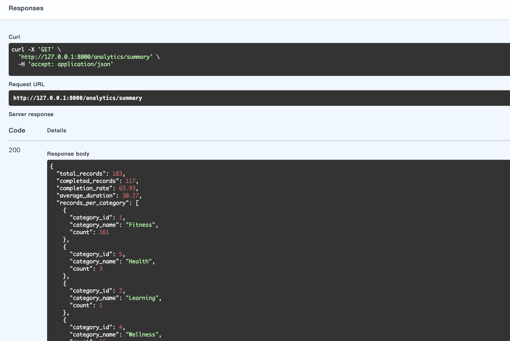

# Habit & Productivity Analytics API

A coursework Web Services API project built with FastAPI. The service provides full CRUD operations for habit categories and habit records, a dedicated analytics endpoint, and JWT-based authentication for protected operations.

## 1) Project Overview

This API supports habit tracking and productivity analysis with the following core capabilities:

- CRUD for `habit_categories` and `habit_records`
- Analytics endpoint: `GET /analytics/summary`
- JWT authentication for protected endpoints
- Structured validation and unified error response shape

## 2) Setup Instructions

Run the following from your terminal step-by-step:

### Step 1 — Clone repository

```bash
git clone <your-repo-url>
cd <repo-folder>
```

### Step 2 — Create and activate virtual environment

```bash
python3 -m venv .venv
source .venv/bin/activate
```

### Step 3 — Install dependencies

```bash
pip install -r requirements.txt
```

### Step 4 — (Recommended) import local CSV seed data

```bash
python scripts/import_data.py
```

### Step 5 — Run API server

```bash
python -m uvicorn app.main:app --reload
```

## 3) Run Instructions

- API base URL: `http://127.0.0.1:8000`
- Swagger UI: `http://127.0.0.1:8000/docs`
- ReDoc: `http://127.0.0.1:8000/redoc`

## 3.1) Frontend Usage (for Demo and Presentation)

This project also includes a lightweight frontend dashboard in `frontend/` for coursework demonstration. It is used to quickly show API health, login status, analytics cards, and demo CRUD actions.

### Start frontend locally

Open a new terminal from project root and run:

```bash
python3 -m http.server 5500
```

Open in browser:

- `http://127.0.0.1:5500/frontend/?local=1` (connect to local FastAPI)
- `http://127.0.0.1:5500/frontend/` (connect to deployed backend by default)

### Frontend quick workflow

1. Click **Demo Login** (uses demo account).
2. Click **Refresh Insights** to fetch `/analytics/summary`.
3. Click create/delete demo category and record buttons to demonstrate protected CRUD.

## 4) API Documentation Link

- https://github.com/X2135/web-service/blob/main/docs/API_Documentation.pdf


## 5) Deployment Information

- Deployed API URL: `https://web-service-fuhg.onrender.com`

## 6) Authentication Summary

JWT is used for authentication. Obtain a token via `POST /auth/login` (or `POST /auth/token` for Swagger OAuth2 form), then send:

```http
Authorization: Bearer <access_token>
```

Protected endpoints:

- `GET /auth/me`
- `POST /habits/categories`
- `PUT /habits/categories/{category_id}`
- `DELETE /habits/categories/{category_id}`
- `POST /habits/records`
- `PUT /habits/records/{record_id}`
- `DELETE /habits/records/{record_id}`

Read endpoints remain open for coursework demonstration (e.g., listing categories/records and analytics summary).

## 7) Example Usage (Login + Protected Call)

```bash
# 1) Login and copy access_token from response
curl -X POST "http://127.0.0.1:8000/auth/login" \
  -H "Content-Type: application/json" \
  -d '{"username":"demo","password":"demo123"}'

# 2) Call a protected endpoint with copied token
curl -X POST "http://127.0.0.1:8000/habits/categories" \
  -H "Content-Type: application/json" \
  -H "Authorization: Bearer <PASTE_ACCESS_TOKEN_HERE>" \
  -d '{"name":"Learning","description":"Reading and study habits"}'
```

## 8) Project Structure

```text
.
├── app/
│   ├── main.py
│   ├── database.py
│   ├── models.py
│   ├── schemas.py
│   ├── crud.py
│   ├── auth.py
│   └── routes/
│       ├── auth.py
│       ├── habits.py
│       └── analytics.py
├── data/
├── scripts/
├── tests/
├── docs/
└── frontend/
```

## 9) Testing

- Run tests:

```bash
pytest
```

- Current test scope covers auth, CRUD, validation, error handling, and analytics.
- Latest project result: **22 tests passed**.

## 9.1) Command-Line Testing for All Core Functions

If you want to test all key features without frontend, use the CLI flow below.

### A) Verify local DB state

```bash
python scripts/verify_db.py
```

### B) Run API behavior check script (auth + protected + error paths)

```bash
python scripts/run_api_checks.py
```

This script checks login success/failure, missing token behavior, duplicate category handling, invalid category reference, create/read flows, and not-found responses.

### C) Run full automated test suite

```bash
pytest -q
```

### D) Manual endpoint checks with curl (recommended for report evidence)

```bash
# 1) health
curl -s "http://127.0.0.1:8000/"

# 2) login
curl -s -X POST "http://127.0.0.1:8000/auth/login" \
  -H "Content-Type: application/json" \
  -d '{"username":"demo","password":"demo123"}'

# 3) list categories (public)
curl -s "http://127.0.0.1:8000/habits/categories?limit=5"

# 4) analytics (public)
curl -s "http://127.0.0.1:8000/analytics/summary"
```

## 9.2) How to Use This Project (Recommended Order)

1. Setup environment and start API.
2. Open Swagger (`/docs`) and verify routes quickly.
3. Choose one interaction mode:
   - frontend demo (`frontend/`) for presentation;
   - CLI (`curl` + scripts + pytest) for reproducible validation.
4. Use JWT token for protected write operations (POST/PUT/DELETE).
5. Use analytics endpoint to summarize habit completion and trends.

## 10) Database

- Local development/testing: SQLite (`habits.db`)
- Production deployment: PostgreSQL via `DATABASE_URL`
- Production safeguard: when environment is production, missing `DATABASE_URL` raises an error (no SQLite fallback)

## 11) Seed Logic (No Duplicate Import)

To avoid duplicate imports on redeploy, this project uses a seed tracking mechanism:

- Seed marker stored in `seed_history`
- Script `scripts/predeploy_seed_once.py` checks whether the named seed has already been applied
- If already applied, seed import is skipped
- If not applied, import runs and then records the seed marker

## 12) Screenshots

### Swagger UI (`/docs`)



### Analytics Endpoint Response (`/analytics/summary`)



---

## Coursework Notes

- This repository is prepared for university Web Services API submission.
- API documentation and technical report are maintained under `docs/`.
- The implementation, validation, and final decisions remain human-led, with GenAI used as an assistive tool.
